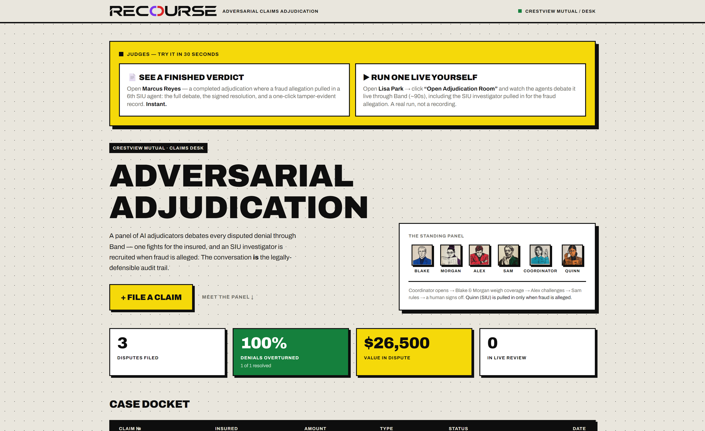

# Recourse — Adversarial Claims Adjudication

> A panel of AI agents puts every disputed insurance claim on trial — and dynamically
> **recruits a sixth investigator the moment fraud is alleged**. The debate **becomes** the
> legally-defensible audit trail. A human officer keeps the final word.

**Band of Agents Hackathon · lablab.ai · Track 3: Regulated & High-Stakes**

🔗 **Live app:** [recourseband.duckdns.org](https://recourseband.duckdns.org)
🎬 **Commercial:** [youtu.be/HhmUWdQ2ZSs](https://youtu.be/HhmUWdQ2ZSs) · 🖥️ **Live walkthrough:** [youtu.be/2hd0-p9l4DE](https://youtu.be/2hd0-p9l4DE) · 📑 **Pitch deck:** [`deck/deck_v4.pdf`](deck/deck_v4.pdf)



## What it does

Crestview Mutual (a fictional insurer) denied a claim. Instead of one overworked
reviewer deciding the appeal alone, **Recourse convenes five specialist agents in a
single Band room** and lets them argue it out:

| Agent | Role | Job |
|-------|------|-----|
| **Coordinator** | Orchestrator | Opens the case, convenes the room, routes every handoff |
| **Blake** | Claims Evaluator | Argues the merits — builds the case *for* the insured |
| **Morgan** | Policy Analyst | Cites the exact governing clauses (§7.3, §12.1 …) via RAG |
| **Alex** | Devil's Advocate | Fights to deny — so no weakness goes unexamined |
| **Sam** | Resolution Notary | Writes the final, signed, reasoned resolution |
| **Quinn** ◉ | Special Investigations Unit | **Not a standing panelist** — the Coordinator *recruits* Quinn into the live room (Band `add_participant`) **only when fraud or misrepresentation is alleged**, so a claim is never denied on unproven suspicion |

**Dynamic agent discovery** — Quinn is summoned mid-debate, on demand, not pre-wired into
every case. When no fraud is alleged the panel stays at five; when the denial rests on a
fraud/misrepresentation claim, the Coordinator pulls in the investigator to test it.

The entire conversation is persisted, ordered, and **SHA-256 hashed** — tamper-evident
on the record. A human claims officer then **approves or overrides** the resolution, and
the closed case is downloadable as a **signed Adjudication Record**.

## Architecture

```
Browser ──► Next.js 14 (App Router)         ── SSE live stream ──►  FastAPI orchestrator
                                                                          │
                          ┌───────────────────────────────────────────────┼───────────────┐
                          ▼                          ▼                      ▼
                 PostgreSQL + pgvector       Band — 5 agents        Model providers
                 claims · transcript ·       + Quinn (recruited     • AI/ML API — GPT-4o (Blake, Morgan, Sam, Quinn)
                 clause embeddings (RAG)      on demand) ·          • Featherless — Hermes-2-Pro (Alex, GPT-4o failover)
                                              @mention routing
```

- **Frontend** — Next.js 14, TypeScript, Tailwind; neo-brutalist "Verdict" design.
- **Backend** — FastAPI, async SQLAlchemy, SSE; a Coordinator-driven turn engine.
- **RAG** — policy clauses embedded with `all-MiniLM-L6-v2` (384-dim), pgvector cosine search.
- **Agents** — a long-lived worker (`agents.run_agents`) keeps the 5 standing Band agents
  connected, plus Quinn on call (recruited into the room only when fraud is alleged).

## Local development

Postgres runs on host port **5433** locally (to avoid clashing with a native install).

### Backend
```bash
cd backend
python -m venv .venv && .venv\Scripts\activate     # Windows
pip install -r requirements.txt
docker compose up -d db                            # from repo root: Postgres 16 + pgvector (5433)
.venv\Scripts\python database/seed_data.py         # seeds the 3-case demo (2 pending + 1 closed w/ Quinn)
uvicorn main:app --reload                          # http://localhost:8000/api/health
```

### Agents (needed for a *live* debate)
```bash
cd backend && .venv\Scripts\python -m agents.run_agents
```

### Frontend
```bash
cd frontend
npm install
npm run dev                                        # http://localhost:3000
```

Copy `backend/.env.example` → `backend/.env` and fill in the Band / AI-ML / Featherless keys.

## Deployment

Production runs as a **Docker Compose stack on a VPS** (`db` · `backend` · `agents` ·
`frontend` · `caddy`), behind **OpenLiteSpeed** as the public reverse proxy with
Let's Encrypt TLS and a DuckDNS domain. The stack lives in [`deploy/`](deploy/):

```bash
cd deploy
cp .env.example .env        # fill in secrets
docker compose up -d --build
docker compose run --rm backend python database/seed_data.py   # seed the 3-case demo
```

> **Quinn is feature-flagged.** Set `BAND_QUINN_AGENT_ID` / `BAND_QUINN_API_KEY` /
> `BAND_QUINN_HANDLE` in `deploy/.env` to enable live recruitment of the 6th agent. Leave
> them blank and the panel runs as the standing five — zero risk, no code change.
>
> `DEPLOY.md` documents an alternative managed-PaaS path (Supabase / Railway / Vercel);
> the live deployment above uses the self-hosted Docker stack in `deploy/`.

## Build status

- [x] Scaffolding, database (schema, models, RAG over pgvector, seed)
- [x] Band SDK + Room Manager + Coordinator orchestration
- [x] The 5 standing agents (Coordinator + Blake, Morgan, Alex, Sam)
- [x] **Quinn (6th agent) — dynamically recruited mid-debate when fraud is alleged**
- [x] FastAPI backend + debate orchestrator + SSE
- [x] Frontend (dashboard, live debate room, resolution panel, signed-record download)
- [x] **Deployed live** + demo video + pitch deck

## License

MIT
